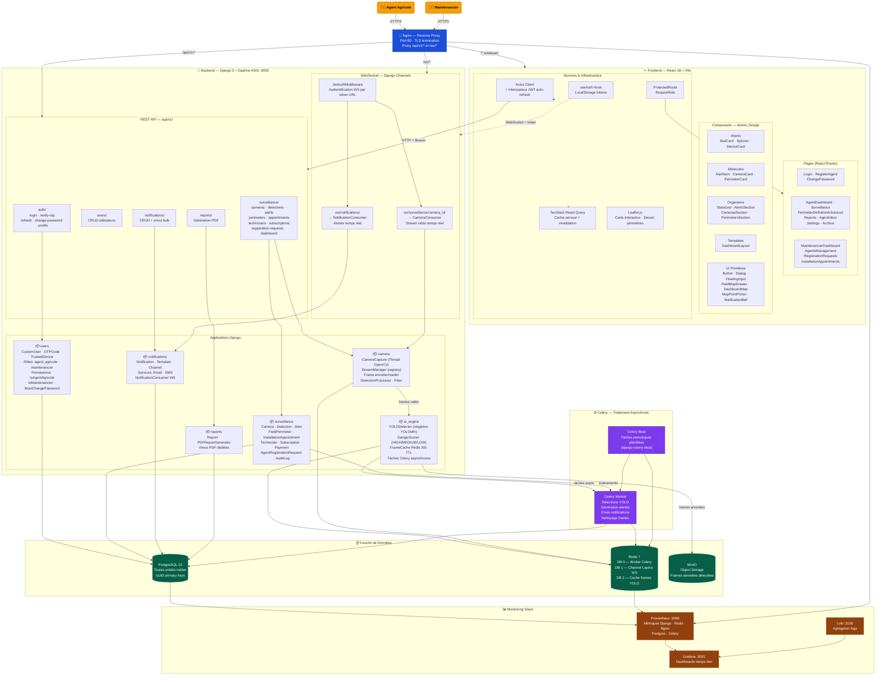
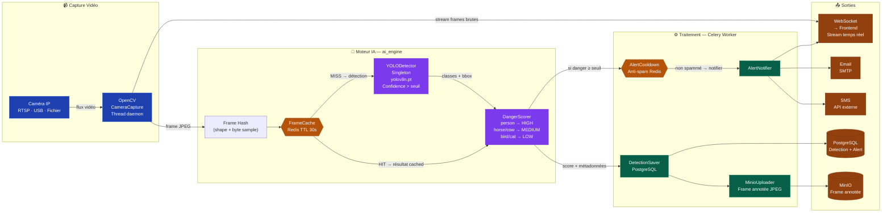
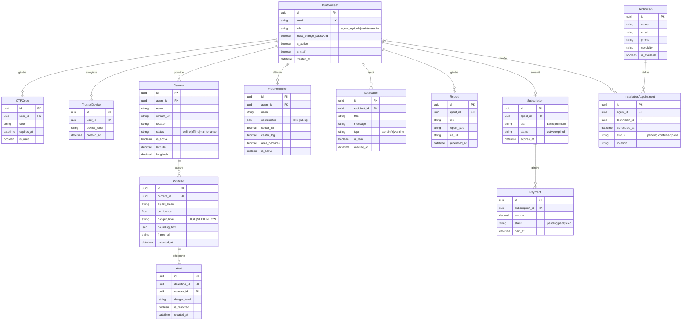
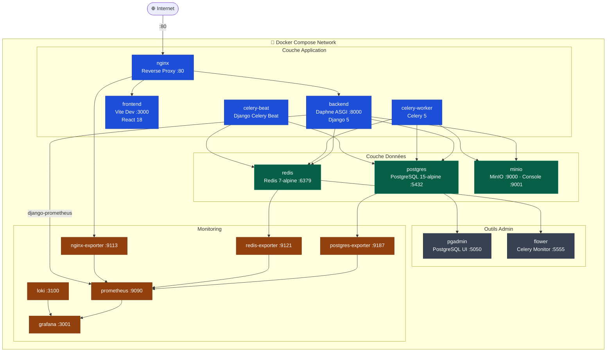

# Architecture Logicielle — AgriWatch
> Plateforme de surveillance agricole par vision par ordinateur (YOLOv8)

---

## 1. Architecture Globale du Système

---

## 2. Pipeline Détection IA — Temps Réel

---

## 3. Flux d'Authentification — JWT + 2FA OTP

```mermaid
sequenceDiagram
    actor User as 👤 Utilisateur
    participant FE  as ⚛️ Frontend React
    participant API as 🐍 Django REST API
    participant DB  as 🗄️ PostgreSQL
    participant EML as 📧 Service Email

    rect rgb(30, 64, 175)
        Note over User,EML: Étape 1 — Connexion & OTP
        User  ->>  FE  : Saisit email + mot de passe
        FE    ->>  API : POST /api/v1/auth/login/
        API   ->>  DB  : Vérifier credentials (CustomUser)
        DB    -->> API : CustomUser {rôle, must_change_password}
        API   ->>  DB  : Créer OTPCode (6 chiffres, TTL 10 min)
        API   ->>  EML : Envoyer code OTP par email
        API   -->> FE  : {otp_required: true, user_id}
        FE    -->> User: Affiche saisie OTP
    end

    rect rgb(6, 95, 70)
        Note over User,EML: Étape 2 — Vérification OTP
        User  ->>  FE  : Saisit le code OTP
        FE    ->>  API : POST /api/v1/auth/verify-otp/
        API   ->>  DB  : Vérifier OTPCode (non expiré, non utilisé)
        DB    -->> API : Valide ✓
        API   ->>  DB  : Invalider OTPCode (usage unique)
        API   -->> FE  : {access_token, refresh_token, user {id, rôle}}
        FE    ->>  FE  : Stocke tokens (localStorage)
        FE    -->> User: Redirige selon rôle (agent / maintenancier)
    end

    rect rgb(124, 58, 237)
        Note over User,EML: Utilisation — Requêtes authentifiées
        User  ->>  FE  : Navigation / action
        FE    ->>  API : GET /api/v1/... (Authorization: Bearer access_token)
        API   -->> FE  : Données JSON
    end

    rect rgb(146, 64, 14)
        Note over User,EML: Renouvellement automatique (401)
        FE    ->>  API : Requête échoue → 401 Unauthorized
        FE    ->>  API : POST /api/v1/auth/refresh/ {refresh_token}
        API   -->> FE  : {access_token} (nouveau)
        FE    ->>  API : Réessaie la requête originale
    end

    rect rgb(30, 64, 175)
        Note over User,EML: WebSocket — Authentification par URL param
        FE    ->>  API : ws://host/ws/surveillance/id/?token=access_token
        API   ->>  API : JwtAuthMiddleware valide le token
        API   -->> FE  : Connexion WebSocket établie
    end
```

---

## 4. Modèle de Données — Entités Principales

---

## 5. Infrastructure Docker Compose

---

*Généré pour la soutenance du projet AgriWatch — Surveillance agricole par IA*
